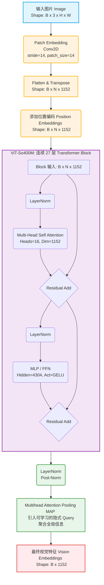

```mermaid
graph TD
    %% 定义样式
    classDef input node,fill:#e1f5fe,stroke:#039be5,stroke-width:2px;
    classDef embed fill:#fff3e0,stroke:#ffb300,stroke-width:2px;
    classDef transformer fill:#f3e5f5,stroke:#8e24aa,stroke-width:2px;
    classDef pool fill:#e8f5e9,stroke:#43a047,stroke-width:2px;
    classDef output fill:#ffebee,stroke:#e53935,stroke-width:2px;

    %% 数据流
    A[输入图片 Image <br> Shape: B x 3 x H x W]:::input --> B(Patch Embedding <br> Conv2D<br>stride=14, patch_size=14):::embed
    B --> C[Flatten & Transpose <br> Shape: B x N x 1152]:::embed
    C --> D(添加位置编码 Position Embeddings <br> Shape: B x N x 1152):::embed
    
    %% Transformer Blocks
    subgraph SiglipEncoder [ViT-So400M: 连续 27 层 Transformer Block]
        direction TB
        E1[Block 输入: B x N x 1152] --> F1(LayerNorm)
        F1 --> G1(Multi-Head Self Attention <br> Heads=16, Dim=1152)
        G1 --> H1{Residual Add}
        E1 --> H1
        
        H1 --> I1(LayerNorm)
        I1 --> J1(MLP / FFN <br> Hidden=4304, Act=GELU)
        J1 --> K1{Residual Add}
        H1 --> K1
    end
    
    D --> SiglipEncoder:::transformer
    
    %% 输出与池化
    SiglipEncoder --> L(LayerNorm<br>Post-Norm):::pool
    L --> M[Multihead Attention Pooling MAP <br> 引入可学习的隐式 Query 聚合全局信息]:::pool
    M --> N[最终视觉特征 Vision Embeddings <br> Shape: B x 1152]:::output
```