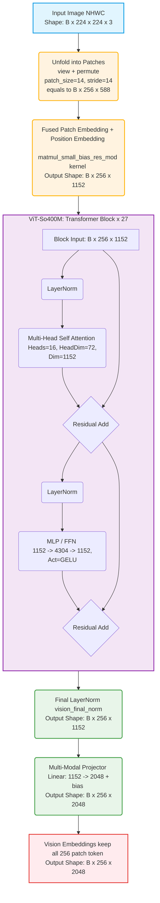
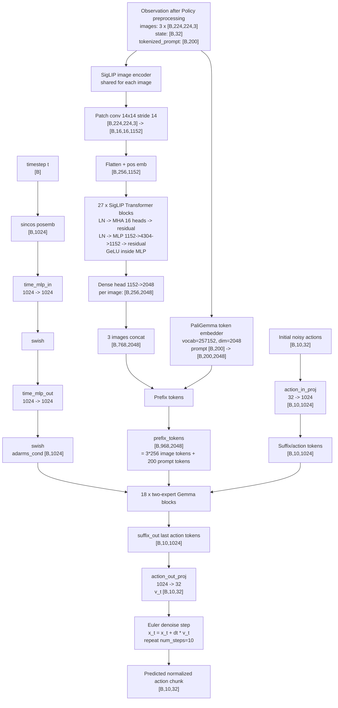

# Model

## SigLIP

### Pipeline

输入: 3 个 [224, 224] 的图片，Channel = Main Camera + Right Hand + Left Hand = 3
> Tip: Right Hand cound be empty

**Unfold & Matmul**: (NHWC)

- input_shape = [B, 224, 224, 3] => (view + permute) => [B, 16, 16, 14, 14, 3]
- kernel_size = patch_size = 14 x 14
- stride = 14
- N = patches number of each pics = (224/14) x (224/14) = 256

- unfold patch [B, 256, 14x14x3=588]
- matmul: [B, 256, 588] x Weight [588, 1152] + bias [1152, ]
- output_shape = [B, 256, 1152]

**Position Embedding**

- Look-Up Table: [N, 1152], Element-wise Addition

**Transformer Block x 27**:

- Block Input = [B, N, 1152]

- Layer Norm for MHSA: [B, N, 1152] => [B, N, 1152]
  
- MHSA(Multi-Head Self Attention)
  - num_heads = 16
  - Attention Map = [B, Head_Dim, N, N]
  - output_shape = [B, N, 1152]

- Residual Addition: [B, N, 1152] => [B, N, 1152]

- Layer Norm for MLP: [B, N, 1152] => [B, N, 1152]

- MLP / FFN
  - Linear: [B, 256, 1152] => [B, 256, 4304]
  - GeLU
  - Linear: [B, 256, 4304] => [B, 256, 1152]

**Post Layer Norm**: [B, N, 1152] => [B, N, 1152]

**End**

### Diagram

### Operators Involved

matmul

Element-Wise: add, sub, mul, div

exp, rsqrt, sigmoid

reduce-sum, reduce-max (归约求最大值)

load, store

cast(bf16↔fp32)

index-compute, mask

## Gemma2

## Overview

