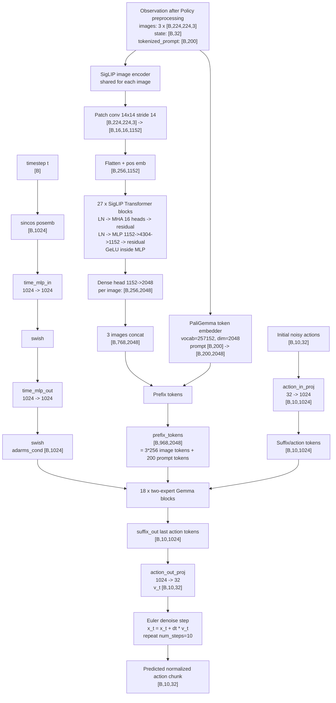

Assuming your active `pi05_libero` config:

```python
Pi0Config(
    pi05=True,
    action_horizon=10,
    action_dim=32,
    discrete_state_input=False,
)
```

Default variants are:

```text
PaliGemma expert: gemma_2b    width=2048, depth=18, mlp_dim=16384
Action expert:   gemma_300m  width=1024, depth=18, mlp_dim=4096
Vision encoder:  SigLIP So400m/14, width=1152, depth=27, mlp_dim=4304
```

Your current [pi0.py](/home/zazzle/openpi/src/openpi/models/pi0.py:66) is locally edited to be PI05-oriented: it always creates `time_mlp_in/out`, and `compute_loss()` is currently `pass`.



Inside the **18 Gemma blocks** from [gemma.py](/home/zazzle/openpi/src/openpi/models/gemma.py:284), each layer has two streams:

```text
Expert 0: PaliGemma/image-language stream
tokens: [B, prefix_len, 2048]

Expert 1: action stream
tokens: [B, action_horizon, 1024]
```

Each block does:

```text
RMSNorm / adaRMSNorm
-> multi-head attention over concatenated prefix + action tokens
-> residual
-> RMSNorm / adaRMSNorm
-> gated MLP
-> residual
```

Attention details from [gemma.py:157](/home/zazzle/openpi/src/openpi/models/gemma.py:157):

```text
num_heads = 8
num_kv_heads = 1
head_dim = 256

Query shape per stream:
PaliGemma: [B,T,8,256]
Action:    [B,T,8,256]

K/V shape per stream:
PaliGemma: [B,T,1,256]
Action:    [B,T,1,256]
```

The streams have different hidden widths, but attention projects both into the same head space, concatenates along token length, attends jointly, then projects back to each stream’s own width.

The Gemma MLP from [lora.py:88](/home/zazzle/openpi/src/openpi/models/lora.py:88) is a gated GeLU MLP:

```text
x -> Linear(features -> hidden_dim) -> GeLU
x -> Linear(features -> hidden_dim)
multiply both branches
-> Linear(hidden_dim -> features)
```

So per block:

```text
PaliGemma MLP: 2048 -> 16384 -> 2048, GeLU gate
Action MLP:    1024 -> 4096  -> 1024, GeLU gate
```

For PI05 specifically, the action expert uses **adaRMSNorm**. The timestep MLP produces `adarms_cond: [B,1024]`, and each action-expert RMSNorm creates:

```text
scale, shift, gate = Dense(1024 -> 3*1024)(adarms_cond)
```

That gate modulates the residual:

```python
x + y * gate
```

So the short architecture summary is:

```text
3 RGB views -> SigLIP So400m/14 -> 768 visual tokens of dim 2048
prompt -> PaliGemma embedder -> 200 language tokens of dim 2048
actions/noise -> Linear -> 10 action tokens of dim 1024
timestep -> sincos -> 2-layer swish MLP -> adaRMS conditioning
18 two-expert Gemma layers -> action hidden states
Linear 1024->32 -> denoising velocity
10 denoising steps -> [10,32] normalized action chunk
```